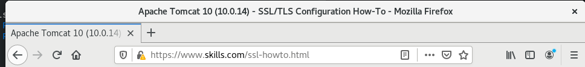
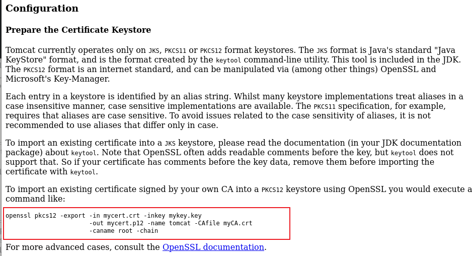
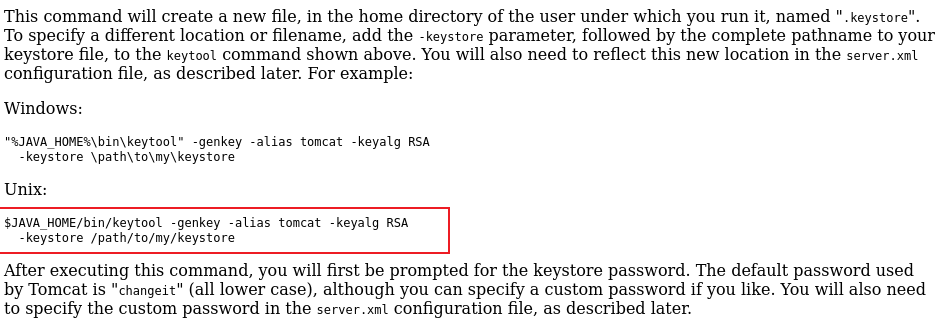
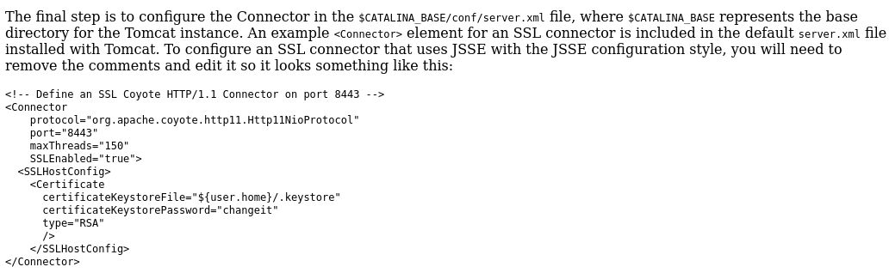
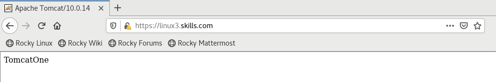

#  Linux部分-Tomcat服务

根据企业需要搭建动态网站，采用 tomcat 实现该需求。
1.配置 linux3 和 linux4 为 Tomcat 服务器，网站默认首页内容分别为“TomcatOne”和“TomcatTwo”，使用 80 端口访问 http 和 443 端 口访问 https；证书路径均为/etc/ssl/skills.jks，证书密码 Pass-1234，格式为 jks。
* 从提供软件目录，将文件存放在 linux3 和 linux4
```bash
# 我这里从自己构建的web站点下载
# root@linux3 linux4
$ yum -y install wget && wget http://10.10.20.100/rocky_linux/games/tomcat/apache-tomcat-10.0.14.tar.gz
$ tar -xf apache-tomcat-10.0.14.tar.gz
$ mv  apache-tomcat-10.0.14  /usr/local/tomcat
# 安装Java运行时
$ yum install java-1.8.0
```
* 需要为tomcat提供jks证书，利用linux2现有的站点，将tomcat的ssl帮助文档复制到linux2
```bash
# root@linux3
$ find /usr/local/tomcat/ -name ssl*.html 
/usr/local/tomcat/webapps/docs/ssl-howto.html
# root@linux2
$ scp root@linux3:/usr/local/tomcat/webapps/docs/ssl-howto.html  /var/www/html/
$  chmod 644 /var/www/html/ssl-howto.html
```
* 通过浏览器访问帮助文档，注意地址

* 将现有crt证书，Key和ca证书发送到linux3
```bash
#root@linux1
$ scp /etc/ssl/ca-server.crt  root@linux3:~
# root@linux2
$scp /etc/pki/tls/certs/skills.crt /etc/pki/tls/private/skills.key  root@linux3:~
```
帮助文档-Configuration > Prepare the Certificate Keystore


```bash
# root@linux3
$  openssl pkcs12 -export -in skills.crt -inkey skills.key \
    -out skills.p12 -name skills -CAfile ca-server.crt \
    -caname root -chain

Enter Export Password: Pass-1234
Verifying - Enter Export Password: Pass-1234
```


```bash
# 上面的帮助只能说明可以使用keytool工具，然后查看man手册 keytool(1)
# $ man keytool
# / IMPORT KEYSTONE
#
#      keytool -importkeystore
#           -srckeystore key.jks -destkeystore NONE
#           -srcstoretype JKS -deststoretype PKCS11
#           -srcstorepass <src keystore password>
#           -deststorepass <destination keystore pwd>
# 将关键文件置换即可
$ keytool -importkeystore  \
        -srckeystore skills.p12 \
        -destkeystore skills.jks \
        -deststoretype PKCS12 \
        -srcstorepass Pass-1234 \
        -deststorepass Pass-1234
$ ls skills.*
skills.crt  skills.jks  skills.key  skills.p12
```
* 修改 `/usr/local/tomcat/conf/server.xml`文件
   查看帮助文档 `Edit the Tomcat Configuration FIle`

```xml
<-- 配置http
-->
 68     <Connector port="80" protocol="HTTP/1.1"
 69                connectionTimeout="20000"
 70                redirectPort="443" />
<--配置https
-->
 85     <Connector port="443" protocol="org.apache.coyote.http11.Http11NioProtocol    " 
 86                maxThreads="150" SSLEnabled="true">
 87         <UpgradeProtocol className="org.apache.coyote.http2.Http2Protocol" />
 88         <SSLHostConfig>
 89                 <Certificate certificateKeystoreFile="conf/skills.jks"  
 90                         certificateKeystorePassword="Pass-1234" 
 91                         type="RSA" />
 92         </SSLHostConfig>
 93     </Connector>

# 将之前生成的 jks证书复制到对应位置
$ cp -v skills.jks /usr/local/tomcat/conf/
'skills.jks' -> '/usr/local/tomcat/conf/skills.jks'
```

* 添加防火墙并启动服务器
```bash
$ firewall-cmd --permanent --add-port=80/tcp --add-port=443/tcp
$ firewall-cmd
$  echo "TomcatOne"  > /usr/local/tomcat/webapps/ROOT/index.jsp
$ /usr/local/tomcat/bin/startup.sh
$ ss -tplna | grep -E ':80|:443'
LISTEN    0      100                     *:80                     *:*     users:(("java",pid=3125,fd=56))                      
LISTEN    0      100                     *:443                    *:*     users:(("java",pid=3125,fd=59))                      
```
* 测试 
> 勘误 http://linux3.skills.com:80

* 同步tomcat 到linux4
```bash
# root@linux3
$ /usr/local/tomcat/bin/shutdown.sh
$ rsync -auP /usr/local/tomcat  root@linux4:/usr/local/
$ /usr/local/tomcat/bin/startup.sh

# root@linux4
$ yum -y install java-1.8.0
$ firewall-cmd --permanent --add-port=80/tcp --add-port=443/tcp
$ firewall-cmd --reload
$ echo "TomcatTwo" > /usr/local/tomcat/webapps/ROOT/index.jsp
$ /usr/local/tomcat/bin/startup.sh
$  ss -tplna | grep :80
LISTEN    0      100                     *:80                    *:*     users:(("java",pid=2978,fd=56)) 
```
* 设置tomcat开机运行，并通过systemd管理
```bash
$ /usr/local/tomcat/bin/startup.sh 
Using CATALINA_BASE:   /usr/local/tomcat
Using CATALINA_HOME:   /usr/local/tomcat
Using CATALINA_TMPDIR: /usr/local/tomcat/temp
Using JRE_HOME:        /usr
Using CLASSPATH:       /usr/local/tomcat/bin/bootstrap.jar:/usr/local/tomcat/bin/tomcat-juli.jar
Using CATALINA_OPTS:   
Tomcat started.
# # 在linux2 上，参考httpd.service ##########################
[root@linux2 ~]# systemctl cat httpd.service 
# /usr/lib/systemd/system/httpd.service
# See httpd.service(8) for more information on using the httpd service.

# Modifying this file in-place is not recommended, because changes
# will be overwritten during package upgrades.  To customize the
# behaviour, run "systemctl edit httpd" to create an override unit.

# For example, to pass additional options (such as -D definitions) to
# the httpd binary at startup, create an override unit (as is done by
# systemctl edit) and enter the following:

#       [Service]
#       Environment=OPTIONS=-DMY_DEFINE

[Unit]
Description=The Apache HTTP Server
Wants=httpd-init.service
After=network.target remote-fs.target nss-lookup.target httpd-init.service
Documentation=man:httpd.service(8)

[Service]
Type=notify
Environment=LANG=C

ExecStart=/usr/sbin/httpd $OPTIONS -DFOREGROUND
ExecReload=/usr/sbin/httpd $OPTIONS -k graceful
# Send SIGWINCH for graceful stop
KillSignal=SIGWINCH
KillMode=mixed
PrivateTmp=true

[Install]
WantedBy=multi-user.target
# # END #########################################
$ useradd -r tomcat
$ chown -R tomcat:tomcat /usr/local/tomcat
$ vim /etc/systemd/system/tomcat.service
[Unit]
Description=The Apache Tomcat Server
After=network.target remote-fs.target nss-lookup.target

[Service]
Type=forking
Environment='CATALINA_BASE=/usr/local/tomcat'
Environment='CATALINA_HOME=/usr/local/tomcat'
Environment='CATALINA_TMPDIR=/usr/local/tomcat/temp'
Environment='JRE_HOME=/usr'
Environment='CATALINA_PID=/usr/local/tomcat/tomcat.pid'
Environment='CLASSPATH=/usr/local/tomcat/bin/bootstrap.jar:/usr/local/tomcat/bin/tomcat-juli.jar'
WorkingDirectory=/usr/local/tomcat
ExecStart=/usr/local/tomcat/bin/catalina.sh start
ExecStop=/usr/local/tomcat/bin/catalina.sh stop -force
ExecReload=/usr/local/tomcat/bin/catalina.sh stop -force && /usr/local/tomcat/bin/catalina.sh start
PrivateTmp=true

[Install]
WantedBy=multi-user.target


$ systemctl daemon-reload 
$ systemctl enable tomcat.service --now
```
2.配置 linux1 为 nginx 服务器，安装 nginx，默认文档 index.html的内容为“HelloNginx”；仅允许使用域名访问，http 访问自动跳转到https，证书路径为/etc/ssl/skills.crt，私钥路径为/etc/ssl/skills.key。
* 安装Nginx软件
```bash
# root@linux1
$ yum -y install  nginx
$ vim /etc/nginx/nginx.conf
     server {
        listen       80 default_server;
        listen       [::]:80 default_server;
        server_name  linux1.skills.com;
        if ($host = '10.10.20.101') {
                return 403;
        }   
        root         /usr/share/nginx/html;
        rewrite ^/(.*)$ https://linux1.skills.com/$1 permanent;
        # Load configuration files for the default server block.
        include /etc/nginx/default.d/*.conf;

        location / { 
                index index.html;
        }   

        error_page 404 /404.html;
            location = /40x.html {
        }   

        error_page 500 502 503 504 /50x.html;
            location = /50x.html {
        }
    }

    server {
        listen       443 ssl http2 default_server;
        listen       [::]:443 ssl http2 default_server;
        server_name  linux1.skills.com;
        root         /usr/share/nginx/html;

        ssl_certificate "/etc/ssl/skills.crt";
        ssl_certificate_key "/etc/ssl/skills.key";
#        ssl_session_cache shared:SSL:1m;
#        ssl_session_timeout  10m;
#        ssl_ciphers PROFILE=SYSTEM;
#        ssl_prefer_server_ciphers on;
#
#        # Load configuration files for the default server block.
#        include /etc/nginx/default.d/*.conf;
#
        location / {
                index index.html;
                #proxy_pass https://tomcat;
        }
#
#        error_page 404 /404.html;
#            location = /40x.html {
#        }
#
#        error_page 500 502 503 504 /50x.html;
#            location = /50x.html {
#        }
    }

}

```
* 将linux3上的证书复制到本地
```bash
$ scp root@linux3:~/skills.* .
$ mkdir -p /etc/pki/nginx/private
$ cp skills.crt /etc/pki/nginx/
$ cp skills.key /etc/pki/nginx/private/
```
* 创建主页并测试
```bash
$ echo "HelloNginx" > /usr/share/nginx/html/index.html
$ firewall-cmd --permanent --add-port=80/tcp --add-port=443/tcp
$ firewall-cmd --reload
$ systemctl enable nginx.service --now
$ ss  -tplna | grep :80
LISTEN 0      128          0.0.0.0:80        0.0.0.0:*     users:(("nginx",pid=3991,fd=8),("nginx",pid=3990,fd=8)) 
```
3.利用 nginx 反向代理，客户端通过 https://tomcat.skills.com 加密访问 Tomcat，实现 linux3 和 linux4 的两个 Tomcat 负载均衡，http 访问通过 301 自动跳转到 https。
* 增加DNS CNAME记录
```bash
# root@linux1
$ vim /var/named/skills.com
tomcat.skills.com. IN CNAME linux1.skills.com.
$ systemctl restart named
```
* 配置反向代理
```bash
$ vim /etc/nginx/nginx.conf
# 在server 80 块前插入
    upstream backends {
        server linux3.skills.com:443;
        server linux4.skills.com:443;
    } 

# 在 当前 server 80 和 server 443 块中间差入
    server {
        listen 80;
        server_name tomcat.skills.com;
        return 301 https://tomcat.skills.com$request_uri;
    }
    server {
        listen 443 ssl;
        server_name tomcat.skills.com;
        location / {
                proxy_pass https://backends;
        }
    }
```
```ini
# 整体如下
# For more information on configuration, see:
#   * Official English Documentation: http://nginx.org/en/docs/
#   * Official Russian Documentation: http://nginx.org/ru/docs/

user nginx;
worker_processes auto;
error_log /var/log/nginx/error.log;
pid /run/nginx.pid;

# Load dynamic modules. See /usr/share/doc/nginx/README.dynamic.
include /usr/share/nginx/modules/*.conf;

events {
    worker_connections 1024;
}

http {
    log_format  main  '$remote_addr - $remote_user [$time_local] "$request" '
                      '$status $body_bytes_sent "$http_referer" '
                      '"$http_user_agent" "$http_x_forwarded_for"';

    access_log  /var/log/nginx/access.log  main;

    sendfile            on;
    tcp_nopush          on;
    tcp_nodelay         on;
    keepalive_timeout   65;
    types_hash_max_size 2048;

    include             /etc/nginx/mime.types;
    default_type        application/octet-stream;

    # Load modular configuration files from the /etc/nginx/conf.d directory.
    # See http://nginx.org/en/docs/ngx_core_module.html#include
    # for more information.
    include /etc/nginx/conf.d/*.conf;

    upstream tomcat {
        server linux3.skills.com:443;
    server linux4.skills.com:443;
    }

    server {
        listen       80 default_server;
        listen       [::]:80 default_server;
        server_name  linux1.skills.com;
    if ($host = '10.10.20.101') {
        return 403;
    }
        root         /usr/share/nginx/html;
        rewrite ^/(.*)$ https://linux1.skills.com/$1 permanent;
        # Load configuration files for the default server block.
        include /etc/nginx/default.d/*.conf;

        location / {
        index index.html;
        }

        error_page 404 /404.html;
            location = /40x.html {
        }

        error_page 500 502 503 504 /50x.html;
            location = /50x.html {
        }
    }
   
    server {
        listen 80;
    server_name tomcat.skills.com;
    location / {
        proxy_pass https://tomcat;
    }
    } 
# Settings for a TLS enabled server.
#
    server {
        listen       443 ssl http2 default_server;
        listen       [::]:443 ssl http2 default_server;
        server_name  linux1.skills.com;
        root         /usr/share/nginx/html;

        ssl_certificate "/etc/ssl/skills.crt";
        ssl_certificate_key "/etc/ssl/skills.key";
#        ssl_session_cache shared:SSL:1m;
#        ssl_session_timeout  10m;
#        ssl_ciphers PROFILE=SYSTEM;
#        ssl_prefer_server_ciphers on;
#
#        # Load configuration files for the default server block.
#        include /etc/nginx/default.d/*.conf;
#
        location / {
        index index.html;
        #proxy_pass https://tomcat;
        }
#
#        error_page 404 /404.html;
#            location = /40x.html {
#        }
#
#        error_page 500 502 503 504 /50x.html;
#            location = /50x.html {
#        }
    }
}
```
```bash
$ systemctl restart nginx.service
```
* 测试
```bash
$ curl -k linux1.skills.com
<html>
<head><title>301 Moved Permanently</title></head>
<body bgcolor="white">
<center><h1>301 Moved Permanently</h1></center>
<hr><center>nginx/1.14.1</center>
</body>
</html>
$ curl -kL linux1.skills.com
HelloNginx
$ curl -kL 10.10.20.101
<html>
<head><title>403 Forbidden</title></head>
<body bgcolor="white">
<center><h1>403 Forbidden</h1></center>
<hr><center>nginx/1.14.1</center>
</body>
</html>
$ curl -kL tomcat.skills.com
TomcatOne
$ curl -kL tomcat.skills.com
TomcatTwo
```


