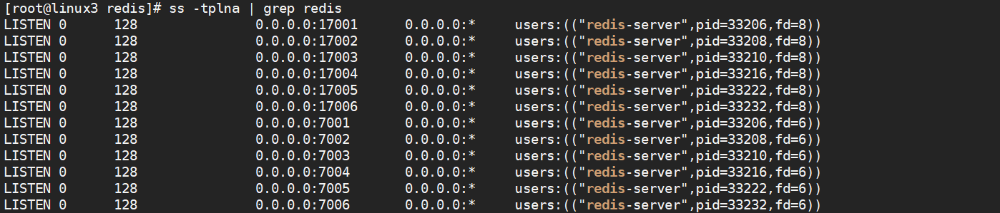
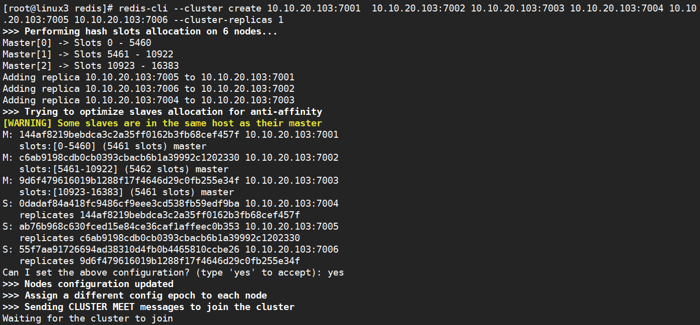
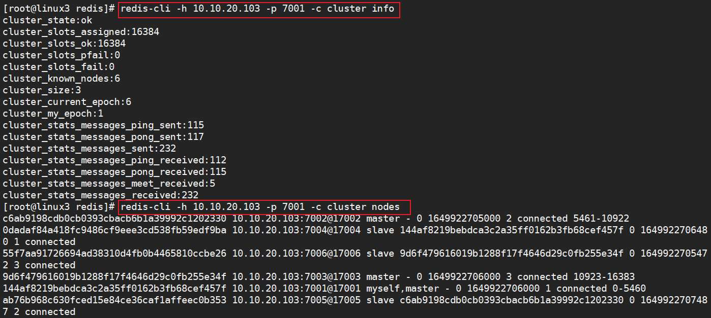

# Redis 服务

为了解决应用服务器的 CPU 和内存压力，减轻 I/O 的压力，请采用 Redis 服务，实现高并发数据和海量数据的读写。
1. 利用 linux3 搭建 redis cluster 集群，使用端口 7001-7003 模拟主节点，7004-7006 模拟从节点
* 将redis 的归档包解压，并安装
```bash
# root@linux3
$ tar -xf redis-6.2.6.tar.gz
$ mv redis-6.2.6 /usr/local/redis
$ cd /usr/local/redis
$ yum -y groups install "Development Tools"
$ make && make install
$ redis-server 
28264:C 14 Apr 2022 10:32:02.878 # oO0OoO0OoO0Oo Redis is starting oO0OoO0OoO0Oo
28264:C 14 Apr 2022 10:32:02.878 # Redis version=6.2.6, bits=64, commit=00000000, modified=0, pid=28264, just started
28264:C 14 Apr 2022 10:32:02.878 # Warning: no config file specified, using the default config. In order to specify a config file use redis-server /path/to/redis.conf
28264:M 14 Apr 2022 10:32:02.878 * Increased maximum number of open files to 10032 (it was originally set to 1024).
28264:M 14 Apr 2022 10:32:02.878 * monotonic clock: POSIX clock_gettime
                _._                                                  
           _.-``__ ''-._                                             
      _.-``    `.  `_.  ''-._           Redis 6.2.6 (00000000/0) 64 bit
  .-`` .-```.  ```\/    _.,_ ''-._                                  
 (    '      ,       .-`  | `,    )     Running in standalone mode
 |`-._`-...-` __...-.``-._|'` _.-'|     Port: 6379
 |    `-._   `._    /     _.-'    |     PID: 28264
  `-._    `-._  `-./  _.-'    _.-'                                   
 |`-._`-._    `-.__.-'    _.-'_.-'|                                  
 |    `-._`-._        _.-'_.-'    |           https://redis.io       
  `-._    `-._`-.__.-'_.-'    _.-'                                   
 |`-._`-._    `-.__.-'    _.-'_.-'|                                  
 |    `-._`-._        _.-'_.-'    |                                  
  `-._    `-._`-.__.-'_.-'    _.-'                                   
      `-._    `-.__.-'    _.-'                                       
          `-._        _.-'                                           
              `-.__.-'                         

# 发送Ctrl+C
```
* 配置redis
```bash
$ mkdir /var/log/redis
$ cd  /usr/local/redis
$ cp redis.conf redis.conf.bak
$ vim redis.conf  
 75 bind 0.0.0.0
  94 protected-mode no
  98 port 7001
257 daemonize yes
 289 pidfile /var/run/redis_7001.pid
 302 logfile "/var/log/redis/redis_7001.log"
 431 dbfilename dump_7001.rdb
1385 cluster-enabled yes
1393 cluster-config-file nodes-7001.conf
1399 cluster-node-timeout 15000
$ grep -E -v '^#|^$' redis.conf > src/redis_7001.conf
$ for i in {2..6};do cp -v src/redis_7001.conf src/redis_700$i.conf;done
$ for i in {2..6};do sed -i "s/7001/700$i/g" src/redis_700$i.conf;done
```

* 启动redis服务器

```bash
$ for i in {1..6};do redis-server src/redis_700$i.conf;done
```


* 创建集群

```bash
$ redis-cli --cluster create 10.10.20.103:7001  10.10.20.103:7002 10.10.20.103:7003 10.10.20.103:7004 10.10.20.103:7005 10.10.20.103:7006 --cluster-replicas 1
```



* 测试
```bash
$ redis-cli -h 10.10.20.103 -p 7002 
10.10.20.103:7002> set key1 val1
OK
10.10.20.103:7002> get key1
"val1"
10.10.20.103:7002> exit

$  redis-cli -h 10.10.20.103 -p 7004 -c
10.10.20.103:7004> get key1
-> Redirected to slot [9189] located at 10.10.20.103:7002
"val1"

```


