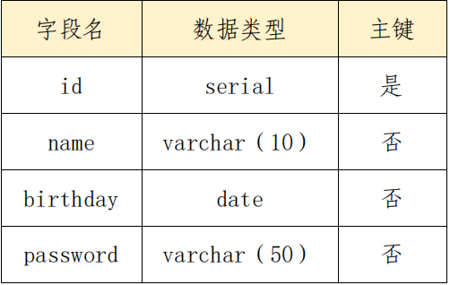

# postgresql服务

为按数据结构来存储和管理数据，请采用 PostgreSQL 服务，实现方便、严密、有效的数据组织、数据维护、数据控制和数据运用。

1.  配置 linux3 为 postgresql 服务器，创建数据库 userdb；在库中
创建表 userinfo，在表中插入 2 条记录，分别为（1,user1，1995-7-1），
（2,user2，1995-9-1），口令与用户名相同，password 字段用 md5 函
数加密，表结构如下：


```bash
$ yum module install postgresql
$ postgresql-setup --initdb --unit postgresql
$ systemctl enable postgresql --now
$ su - postgres
$ psql
postgres=# alter user postgres with password 'Pass-1234';
postgres=# create database userdb;
postgres=# \q
$ exit
$ vim /var/lib/pgsql/data/postgresql.conf
59 listen_addresses = '*'
88 password_encryption = md5 
$ vim  /var/lib/pgsql/data/pg_hba.conf
host all all 0.0.0.0/0   md5
$ systemctl restart postgresql.service
$ psql -U postgres -h 10.10.20.103 -d userdb
userdb=# create table userinfo (id serial primary key,name varchar(10),birthday date,password varchar(50));
userdb=# insert into userinfo values(1,'user1','1995-7-1',md5('user1'));
INSERT 0 1
userdb=# insert into userinfo values(2,'user2','1995-9-1',md5('user2'));
INSERT 0 1
userdb=# \q
```
2. 设置可以直接在 shell 下操作数据库，然后备份数据库 userdb
到/var/local/postgresqlbak/userdb.sql
```bash
$ mkdir /var/local/postgresqlbak
$  pg_dump -U postgres -h 10.10.20.103 -d userdb > /var/local/postgresqlbak/userdb.sql
Password: 
```
