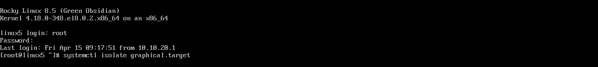
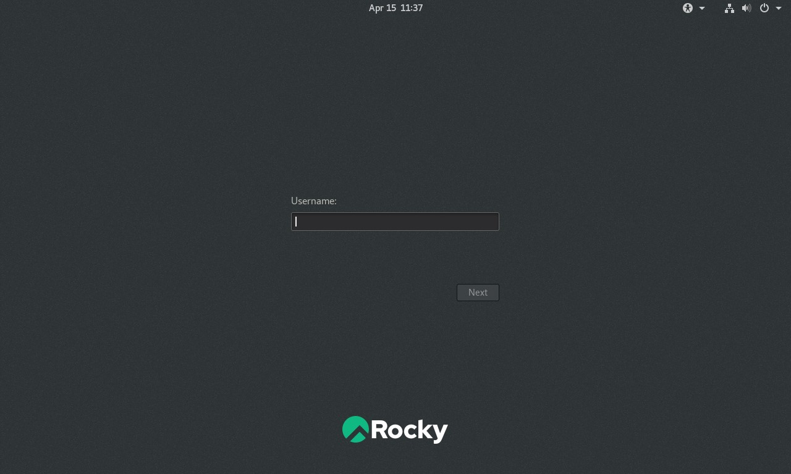
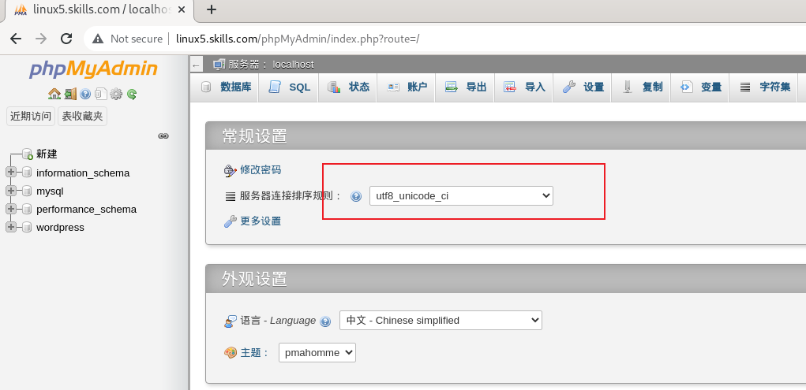
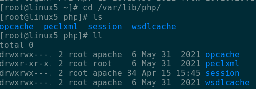
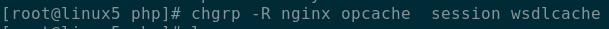

# WordPress 服务
为了推广产品，提升品牌形象，合理利用资源，降低成本，请采用 WordPress 服务，为企业建立博客。
1. 在 linux5 上安装图形界面，并设置默认启动模式为图形界面。安装 xrdp，物理机可以使用远程桌面连接该主机。
```bash
$ yum groups list | grep GUI
   Server with GUI
$ yum groups install "Server with GUI"
$  systemctl is-enabled gdm
enabled
$ systemctl set-default graphical.target
$ yum remove gnome-initial-setup
# 使用物理终端，来到tty1 (默认的文本终端)
$ systemctl  isolate  graphical.target  # 或者重启系统
# 如下图
```


```bash
$ yum install xrdp
$ systemctl enable xrdp --now
$ firewall-cmd --permanent --add-port=3389/tcp 
$ firewall-cmd
```
* 测试，windows上使用远程桌面连接输入 10.10.20.105 进行连接测试

2.  配置 C 语言和 C++语言的编译环境。
```bash
$ yum groups info  "Development Tools" | grep 'c++'
$ yum groups install  "Development Tools" 
```
3.  安装 nginx、mariadb、php、phpMyAdmin 和 wordpress，创建数据库 wordpress，数据库字符集为 utf8-unicode-ci；创建用户 test，对所有数据库有完全权限。
* 安装所需软件包
```bash
$ yum module install  nginx mariadb php
$ systemctl enable nginx --now
$ firewall-cmd --permanent --add-port=80/tcp
$ firewall-cmd --reload
```
* 配置数据库
```bash
# 初始化
$ systemctl enable mariadb --now
$ mysql_secure_installation
$ mysql -u root -p
```
* 创建数据库
```sql
MariaDB [(none)]> SHOW COLLATION LIKE 'utf8%';
MariaDB [(none)]> CREATE DATABASE wordpress;
MariaDB [(none)]> CREATE USER test@localhost IDENTIFIED BY 'test';
MariaDB [(none)]> GRANT ALL PRIVILEGES ON *.* TO test@localhost;
MariaDB [(none)]> FLUSH PRIVILEGES;
MariaDB [(none)]> exit
```
4. 利用 linux5 上浏览器搭建 wordpress 博客，站点标题为“This is my blog!”。
```bash
$ yum install php
$ yum install  php php-mysqlnd php-intl
$ vim /etc/php-fpm.d/www.conf
 25 user = nginx
 28 group = nginx
$ rm -rf /usr/share/nginx/html
$ tar -xf wordpress-5.9.3.tar.gz
$ mv wordpress /usr/share/nginx/html
$ cd /usr/share/nginx/html
$ cp wp-config-sample.php wp-config.php
$ vim wp-config.php
 23 define( 'DB_NAME', 'wordpress' );
 24 
 25 /** Database username */
 26 define( 'DB_USER', 'test' );
 27 
 28 /** Database password */
 29 define( 'DB_PASSWORD', 'test' );
 30 
 31 /** Database hostname */
 32 define( 'DB_HOST', 'localhost' );
 33 
 34 /** Database charset to use in creating database tables. */
 35 define( 'DB_CHARSET', 'utf8-unicode-ci' );
 36 
```
* phpmyadmin
```bash
$ tar -xf phpMyAdmin-5.1.3-all-languages.tar.gz
$ mv phpMyAdmin-5.1.3-all-languages /usr/share/nginx/html/phpMyAdmin
$ vim /etc/nginx/nginx.conf
 41         server_name  linux5.skills.com;
 48           index index.php;
```
* 设置数据库字符集

* 访问 http://linux5.skills.com 初始化wordpress并创建博客
> 修复phpMyAdmin不能访问
> 

> 



